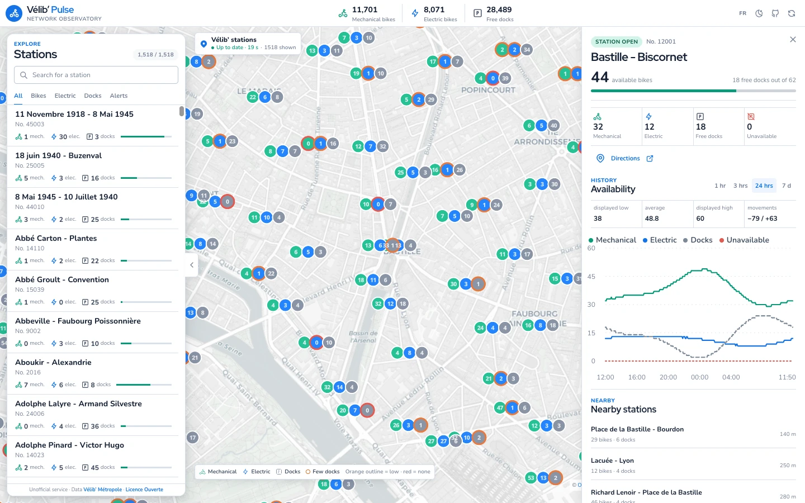
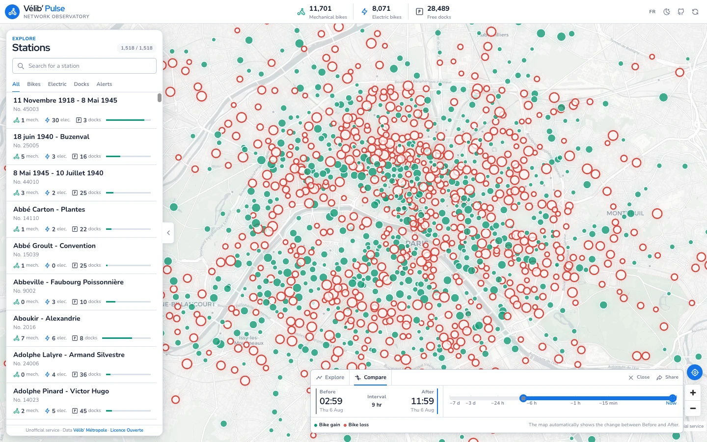

# Vélib’ Pulse

A map-first view of Vélib’ Métropole availability, live network changes, and seven days of station history.

[**Open Vélib’ Pulse →**](https://velib.stanislas.cloud)

<p align="center">
  
  <br>
  <sub>Live station availability over 24 hours</sub>
</p>

<p align="center">
  
  <br>
  <sub>Network gains and losses in archive comparison mode</sub>
</p>

Vélib’ Pulse is an independent, unofficial service. It is not affiliated with Vélib’ Métropole or Smovengo.

## Highlights

- Live mechanical bikes, electric bikes, and open docks across the network.
- Search, filters, nearby stations, and seven days of station history.
- Live WebSocket updates backed by authoritative D1 snapshots.
- Archive playback and before-and-after network comparison.
- Shareable views that preserve the map, filters, station, and archive time.
- French and English interfaces with responsive light and dark themes.

## Local development

```bash
bun install
cp .dev.vars.example .dev.vars
bun run db:migrate:local
bun run dev --host 127.0.0.1
```

Open <http://127.0.0.1:5173>. See [Development](docs/development.md) to populate local data, run tests, and understand the project layout.

## Documentation

- [Development](docs/development.md) — local setup, commands, and troubleshooting
- [Architecture](docs/architecture.md) — runtime components, storage, and data flows
- [Operations](docs/operations.md) — deployment, rollback, and D1 recovery

## Data and attribution

Availability and station metadata come from the [Vélib’ Métropole GBFS open-data feeds](https://www.velib-metropole.fr/donnees-open-data-gbfs-du-service-velib-metropole), published under the French [Licence Ouverte 2.0](https://www.etalab.gouv.fr/licence-ouverte-open-licence/). Map data is attributed in the interface by the configured basemap provider.

## License

The application source is available under the [MIT License](LICENSE). Source data remains subject to the Licence Ouverte and each basemap provider’s terms.
